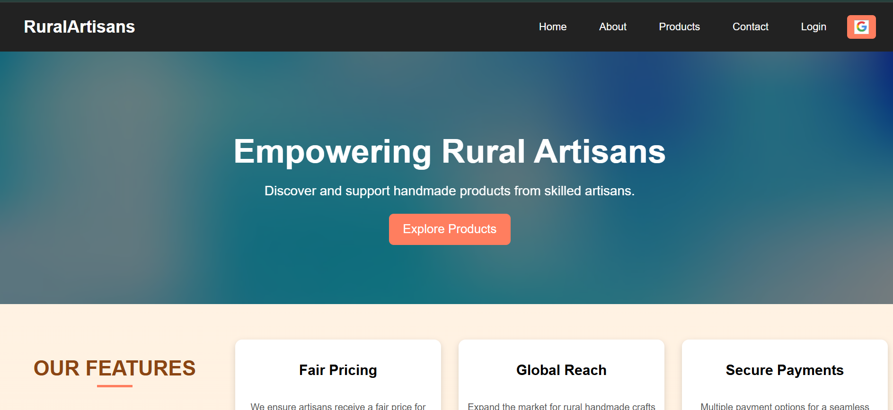
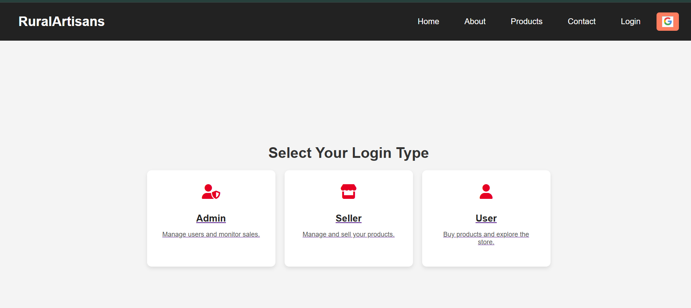
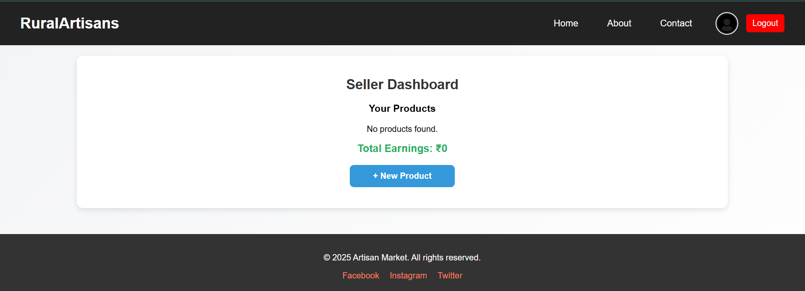
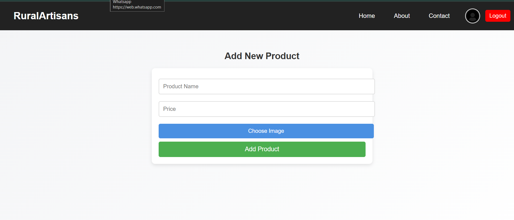

# 🛍️ Artisan-e-Commerce Platform

## 🧵 Problem
**Rural artisans struggle to sell their handmade products to a broader audience.**  
Due to lack of technical knowledge, digital exposure, and access to marketplaces, artisans often rely on middlemen, resulting in low profits and limited market reach.

---

## 📜 Description
This project is a **comprehensive e-commerce platform built using the MERN stack** (MongoDB, Express, React, Node.js), specifically designed to empower rural artisans by enabling them to sell their handmade products directly to a wider audience.

**Key objectives:**
- Multilingual support for inclusivity
- Easy onboarding process for non-tech-savvy users
- Secure payment gateway integration
- Efficient logistics and order tracking
- Storytelling feature for each product and artisan
- Fair price suggestion engine

---

## 🖼️ Screenshots

### 1.


### 2.


### 3.


### 4.


---

## 🚀 Features

- 🗣️ **Multilingual Interface**: Choose preferred language (Tamil, Hindi, English, etc.)
- 🔐 **Secure Authentication**: Artisan and customer login/signup
- 📷 **Product Upload**: Add product images, prices, and stories
- 🧾 **Digital Receipts**: Auto-generate receipts and send via WhatsApp/SMS
- 📦 **Order & Delivery Tracking**: Real-time logistics and delivery updates
- 📈 **AI-Powered Insights**: Forecast product demand and pricing
- 🧑‍🎨 **Artisan Profiles**: Showcase artisan’s background, awards, and story
- 💳 **Integrated Payments**: UPI, Cards, Net Banking
- 📣 **Marketing Tools**: Product promotions, discounts, and storytelling features

---

## 🧑‍💻 Tech Stack

| Technology | Description                  |
|------------|------------------------------|
| MongoDB    | NoSQL Database                |
| Express.js | Web Framework for Node.js     |
| React.js   | Frontend UI Library           |
| Node.js    | Backend Runtime Environment   |
| Mongoose   | ODM for MongoDB               |
| JWT/Auth   | Secure Login & Role Handling  |
| Cloudinary | Image Uploads                 |
| Razorpay/Stripe | Payment Gateway Integration |

---

## 📂 Folder Structure

```
root/
│
├── client/                 # React Frontend
│   ├── public/
│   └── src/
│       ├── components/
│       ├── pages/
│       └── App.js
│
├── server/                 # Express Backend
│   ├── controllers/
│   ├── models/
│   ├── routes/
│   └── server.js
│
├── images/                 # Screenshots for README
├── .env
└── README.md
```

---

## ⚙️ Setup Instructions

### 1. Clone the Repository

```bash
git clone https://github.com/your-username/artisan-ecommerce.git
cd artisan-ecommerce
```

### 2. Backend Setup

```bash
cd server
npm install
touch .env
# Add Mongo URI, PORT, JWT_SECRET, etc. to .env
npm start
```

### 3. Frontend Setup

```bash
cd client
npm install
npm start
```

---

## 💡 Future Improvements

- AI-based artisan skill recommendation
- Local language voice-guided onboarding
- Mobile App version with offline access
- Direct integration with India Post and courier APIs

---


## 🔗 Project Tags

`#MERN` `#Ecommerce` `#RuralEmpowerment` `#Handicrafts` `#MultilingualPlatform` `#FairTrade` `#ArtisanMarket`

---

##_Still working_

